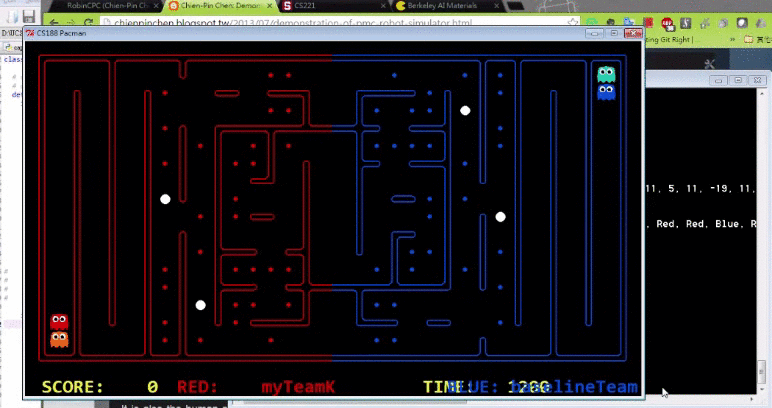
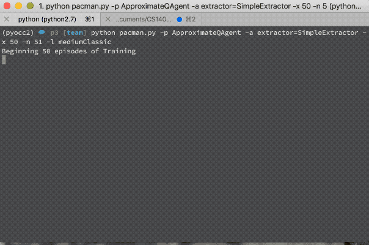
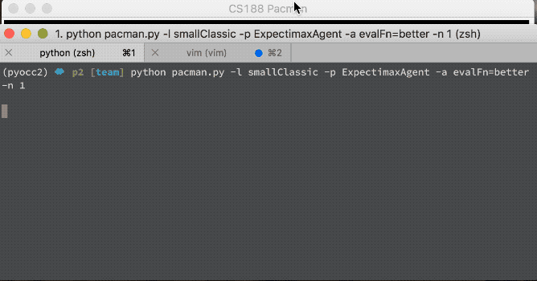
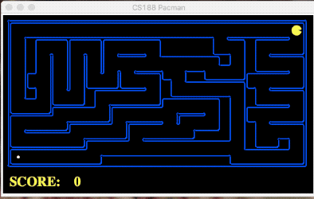
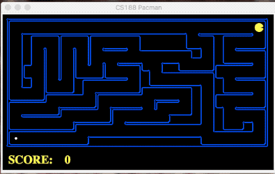
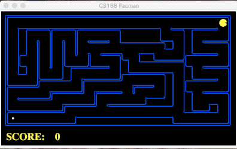

# CS140 - Artificial Intelligence
## Programming HW of UCSC CS140
This repo is for personal stdudy and I have not intention to go aginst the honor code.

* Contest - Pacman Capture the Flag
    1. Adopted Model-based reflex Agent to collect food and chase enemies
    2. Designed behavior tree to help agents switch their duties
    3. Utilized k-means to cluster foods for distributing our Pacman agents

* P3 - Reinforcement Learning
    Approximate Q-Learning

* P2 - Multi-Agent Pacman

* P1 - Search in Pacman

| **A-Star**                    | **BFS**                   | **DFS**                   |
| :----:                        | :----:                    | :----:                    |
|  |  |  |

* P0 - Unix/Python/Autograder Tutorial

